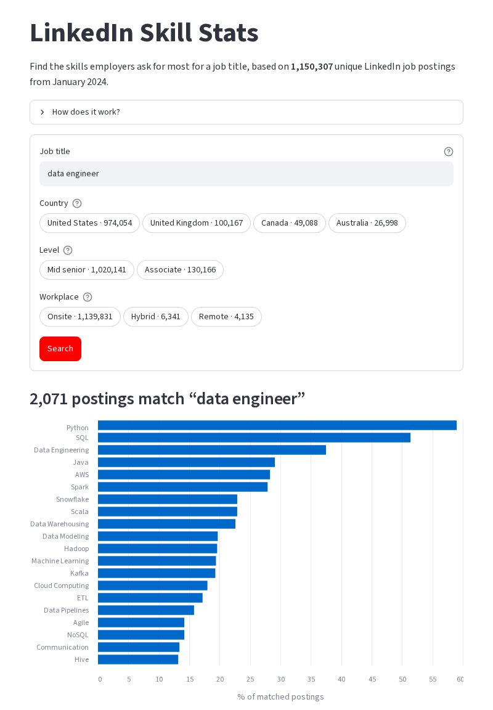
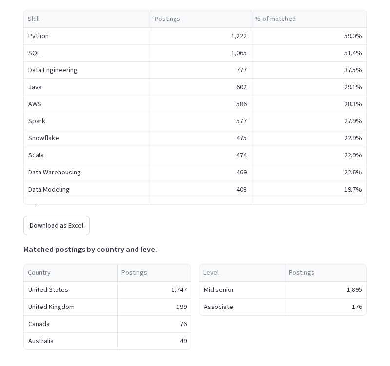

# LinkedIn Skill Stats

[](https://github.com/Agnesor/linkedin-skills/actions/workflows/ci.yml)
[](LICENSE)
[](https://opendatacommons.org/licenses/by/1-0/)

Type a job title and see which skills employers ask for most, based on 1.15 million unique LinkedIn job postings from January 2024.

**Live demo:** https://linkedin-skills-master-se7dhudlbq-uc.a.run.app


## What it does

- Finds postings whose title contains every word of your query as a whole word, in any order: `QA` does not match "aqua", while `C++`, `C#` and `.NET` work as expected.
- Filters by country (US, UK, Canada, Australia), level (mid-senior, associate) and workplace (onsite, hybrid, remote).
- Shows the top skills as a chart and a table with the number and share of matched postings that list each skill, plus a breakdown of the matches by country and level.
- Exports the table to Excel.

| Top skills | Table and breakdown |
|---|---|
|  |  |

## How it works

```
Kaggle CSVs ──► scripts/build_dataset.py ──► 3 Parquet files (70 MB) ──► GitHub Release
                                                                            │
GitHub push ──► Cloud Build ──► Docker image (downloads + verifies data) ──► Cloud Run
                                                                            │
                                   Streamlit UI ◄── DuckDB queries over Parquet
```

- **Data pipeline.** [`scripts/build_dataset.py`](scripts/build_dataset.py) joins the postings and skills CSVs with DuckDB, collapses reposts of the same job, normalizes skills, drops skills seen only once and writes three compact Parquet files plus a manifest with checksums.
- **App.** [`main.py`](main.py) is a Streamlit UI; [`app/`](app) holds the search logic ([`search.py`](app/search.py) builds parameterized SQL), data access ([`data.py`](app/data.py): one DuckDB connection, a cursor per query) and the Excel export. A search over 1.15 M postings takes well under a second.
- **Deployment.** The Docker image downloads the Parquet files from the [`data-v1` release](https://github.com/Agnesor/linkedin-skills/releases/tag/data-v1) and checks them against [`data.sha256`](data.sha256), runs as a non-root user and needs no cloud credentials. Google Analytics is added only when `GA_MEASUREMENT_ID` is set.

Stack: Python 3.12, Streamlit, DuckDB, pandas, Altair, uv, Docker, Google Cloud Run and Cloud Build, GitHub Actions.

## Run it locally

With [uv](https://docs.astral.sh/uv/):

```bash
git clone https://github.com/Agnesor/linkedin-skills.git
cd linkedin-skills
uv sync
uv run scripts/fetch_data.py          # downloads ~70 MB into data/ and verifies checksums
DATA_DIR=data uv run streamlit run main.py
```

With Docker:

```bash
docker build -t linkedin-skills .
docker run --rm -p 8080:8080 linkedin-skills
# open http://localhost:8080
```

Run the checks:

```bash
uv run ruff check . && uv run ruff format --check .
uv run pytest
```

## Data

Source: [1.3M LinkedIn Jobs & Skills (2024)](https://www.kaggle.com/datasets/asaniczka/1-3m-linkedin-jobs-and-skills-2024) by [asaniczka](https://www.kaggle.com/asaniczka), licensed under the [Open Data Commons Attribution License 1.0](https://opendatacommons.org/licenses/by/1-0/). The Parquet files in the release are a derived database under the same license.

To rebuild them, download `linkedin_job_postings.csv` and `job_skills.csv` from Kaggle and run:

```bash
uv run scripts/build_dataset.py --postings linkedin_job_postings.csv --skills job_skills.csv --out data
```

| File | Columns | Rows |
|---|---|---|
| `postings.parquet` | `pid`, `title_norm`, `country`, `level`, `job_type` | 1,150,307 |
| `skills.parquet` | `sid`, `skill` | 760,385 |
| `posting_skills.parquet` | `pid`, `sid` | 22,084,635 |

Limitations worth knowing:

- It is a snapshot of postings scraped in January 2024, mid-senior and associate levels only.
- Skills were extracted from job descriptions by a NER model, so the long tail is noisy.
- About 99% of postings are onsite; hybrid and remote filters leave small samples.
- Reposts with the same title, company and location count once; postings without skills are excluded, so every percentage is over postings that list at least one skill.

## Roadmap

- Fresher data (2025+) with skills extracted from job descriptions, to compare demand over time.
- Grouping of synonymous skills ("Communication" and "Communication skills").

## Contributing and security

Issues and pull requests are welcome. Please report vulnerabilities privately, see [SECURITY.md](SECURITY.md).

## License

Code: [MIT](LICENSE) © 2025 Ilia Reutov. Data: ODC-By 1.0, © asaniczka.

Made by [Ilia Reutov](https://www.linkedin.com/in/ilia-reutov/). If you find it useful, you can [buy me a coffee](https://www.buymeacoffee.com/Ilia_reutov).
